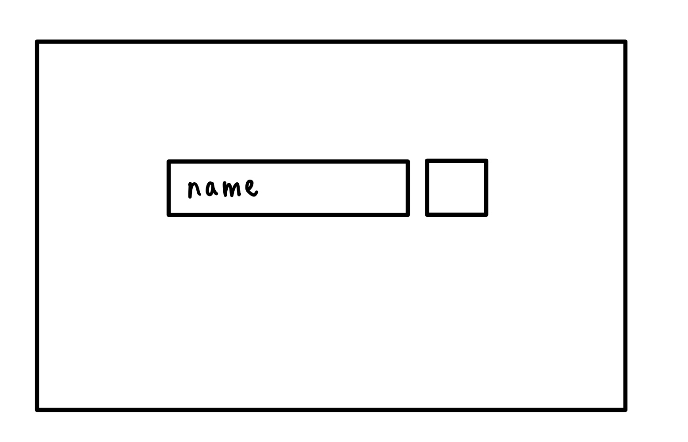
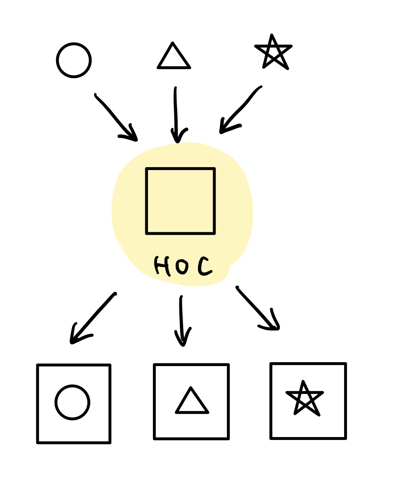

# 커스텀 훅 패턴 (Custom Hook Pattern)

## 커스텀 훅 패턴 (Custom Hook Pattern) 이란?

- **재사용 가능한 로직을 하나의 함수로 캡슐화하는 방법**
    
    기존의 React Hooks (ex. useState, useEffect …)를 사용하여 상태 관리나 사이드 이펙트 처리를 컴포넌트 내에서 수행할 수 있지만, 이를 이용하여 여러 컴포넌트에서 비슷한 로직이 반복되면 코드의 중복이 발생할 수 있다. 이러한 문제를 해결하기 위해 **커스텀 훅**을 사용하여 공통 로직을 분리하고 재사용할 수 있다.
    

<aside>


즉, 커스텀 훅은 **상태 관리 및 사이드 이펙트를 다루는 로직을 분리하여 재사용하는 패턴**을 말한다.

- **상태** : 컴포넌트가 기억해야할 값
    
    ex) 카운터 숫자, 사용자 입력 텍스트, 모달 열렸는지 여부 등
    
    ⇒ 주로 `useState`로 관리
    
- **사이드 이펙트** : 컴포넌트 내부의 렌더링과 관련없는 외부와 상호작용하는 모든 작업
    
    ex) API 요청, console.log, 이벤트 등록, DOM 조작 등
    
    ⇒ 주로 `useEffect`로 관리
    
</aside>

<br/>
<br/>

## Utility Function과 커스텀 훅의 차이

|  | **커스텀 훅** | **유틸리티 함수**  |
| --- | --- | --- |
| **사용 목적** | 상태 관리 및 사이드 이펙트를 포함한 비즈니스 로직 재사용 | 순수 계산, 변환, 포맷 등 상태와 무관한 로직 처리 |
| **React Hook 사용 여부** | `useState`, `useEffect`, `useContext` 등 React Hook을 포함함 | React Hook을 사용하지 않음 (순수 JS) |
| **반환 형태** | 객체, 값, 함수 등 컴포넌트에서 사용하는 상태나 핸들러 반환 | 단일 값이나 계산 결과 반환 |
| **의존 대상** | React의 렌더링 사이클 및 생명주기에 의존 | 렌더링 사이클과 무관함 |
| **파일 위치** | 일반적으로 `hooks/` 폴더에 분리 | `utils/` 폴더에 분리 |
| **관심사 분리** | **UI-로직 분리**에 기여 (상태/효과 중심) | **계산/포맷 등의 순수 로직 분리**에 기여 |

⇒ **로직의 성격이 상태에 의존하는지, 순수 계산인지에 따라 두 방식을 적절히 분리해서 사용하는 것이 좋다.**

<br/>
<br/>

## 커스텀 훅의 활용

> `App` 컴포넌트에 이름을 입력받는 창을 만들어보자.
> 



```jsx
function App() {
const [value, setValue] = useState('');

const onClick = () => {
    클릭 이벤트
};

    return (
        <form className='box'>
                <input placeholder='name' value={value} />
                <button onClick={onClick} />
        </form>
    );
}
```

이때 `App` 컴포넌트의 역할은 form에 대한 UI를 그리는 것, 확인 버튼을 누르면 input field값을 넘기는 것 이 정도 일 것이다.

하지만 실제로 컴포넌트를 구현하면, 아래와 같이 input 값을 받아오는 로직을 app 컴포넌트 안에 구현해줘야한다.

```jsx
function App() {
const [value, setValue] = useState('');

const onClick = () => {
    클릭 이벤트
};

// 유효성 검사
const isValid = (value) => value.length <= 10 

// input 값 상태 관리 로직
const onChange = (e) => {
        const { value } = e.target;

    let willUpdate = true;
    willUpdate = isValid(value);

    if (willUpdate) {
      setValue(value);
    }
};

    return (
        <div className='box'>
                <input placeholder='Name' value={value} onChange={onChange}/>
                <button onClick={onClick} />
        </div>
    );
}
```

결과적으로 app 컴포넌트는 부여된 역할을 넘어서 추가적인 잡다한 역할을 하고 있게 된다. 

이때 여기서 input field와 관련된 로직을 custom hook으로 분리한다면, app 컴포넌트는 자신만의 역할만 명확히 수행할 수 있게 된다.

```jsx
// custom hook으로 분리
const useInput = () => {
  // 상태 관리
  const [value, setValue] = useState('');

  const isValid = (value) => value.length <= 10 

  const onChange = (e) => {
        const { value } = e.target;

    let willUpdate = true;
    willUpdate = isValid(value);

    if (willUpdate) {
      setValue(value);
    }
  };

  return { value, onChange };
};
```

```jsx
// 훨씬 깔끔해진 app 컴포넌트
function App() {
  const { value, onChange } = useInput();

  const onClick = () => {
    클릭 이벤트
   };

  return (
    <div className='box'>
      <input placeholder='Name' value={value} onChange={onChange} />
            <button onClick={onClick} />
    </div>
  );
}

export default App;

```
<br/>


### **장점**

- **로직 재사용 가능**
    
    중복되는 로직을 하나의 훅으로 묶어두었기 때문에 여러 컴포넌트에서 재사용이 가능하게 된다. 
    
    ex) input을 상태를 처리하는 로직을 다른 컴포넌트에서도 가져다 쓸 수 있다.
    
- **관심사 분리**
    
    기능에 대한 로직을 분리함으로써 View와 Logic을 분리하여 관심사 분리가 가능해진다.
    
    ex) input을 처리하는 Logic과 app의 UI를 다루는 컴포넌트를 분리하여, 커스텀 훅에서 로직을 다루고 app은 UI 렌더링의 한가지 일만 가능해졌다.
    
    <aside>
    
        **관심사 분리 (Separation of Concerns, SoC)**
        
        하나의 단위(함수, 클래스, 컴포넌트)는 **하나의 일만 하도록** 만드는 설계 원칙
        
        특징 : 낮은 결합도(Loosing Coupling), 높은 응집도(High Cohesion)으로, 모듈 간 의존성은 낮으며 모듈 내의 관련성은 높임
    </aside>
    
- **테스트 용이**
    
    하나의 훅이 고립된 상태를 갖기 때문에, 다른 상태나 모듈 등에 의존하지 않고 독립적인 테스트가 가능해진다.
    
    ex) hook을 분리하기 전에는 `onChange`, `useState`가 UI와 결합되어 있어서 테스트하려면 전체 `App` 컴포넌트를 렌더링해야 해야했다. hook으로 분리 후, input 컴포넌트를 렌더링할 필요 없이 input을 독립적으로 테스트할 수 있게 됐다.
    

<br/>

### **단점**

- **상태 및 렌더링 흐름의 추적 어려움**
    
    custom hook을 사용하면 관리해야할 상태와, 사이드이펙트를 컴포넌트 밖으로 분리한다. 즉, 이러한 부분이 렌더링하는 부분과 분리되어 있기 때문에, 상태나 렌더링 흐름을 추적하기 어려워진다.
    
    ex) `useInput` 훅 내부에서 `setValue`가 호출되었을 때 어떤 UI가 리렌더링되는지 추적하려면, 훅을 사용하는 컴포넌트까지 거슬러 올라가야 한다.
    
- **성능 최적화를 놓치기 쉬움**
    
    커스텀 훅이 외부로 분리되어있기 때문에, 내부에서 정의된 함수나 연산이 실제 컴포넌트에서 어떻게 사용되는지 한눈에 파악하기 어렵다. 이러한 상황에서 커스텀 훅 내부에 `useEffect`, `useCallback`, `useMemo` 등 최적화 도구에 적절한 의존성 배열을 넣지 않는다면, 불필요한 리렌더링이나 비효율적인 연산 재실행이 발생할 수 있어 성능 최적화를 놓치기 쉽다.
    

<br/>
<br/>

## 커스텀 훅 규칙

1. **Hook 이름이 use로 시작해야한다.**
2. **최상위에서만 Hook을 호출해야 한다.**
    - 반복문, 조건문, 중첩된 함수 내에서 Hook을 호출하면 안된다.
        
        <aside>
        
        **왜 항상 최상위에서만 호출해야할까?**
        
        ⇒ **React는 Hook을 호출되는 순서(index)로 기억하기 때문이다.**
        
        ```jsx
        // hook의 호출 순서가 보장된 경우
        function MyComponent() {
          useState(0);      // ← 첫 번째 Hook
          useEffect(() => {
            // ...
          }, []);          // ← 두 번째 Hook
        }
        ```
        
        ```jsx
        // hook의 호출 순서가 보장되지 않은 경우
        function MyComponent() {
          const isLoggedIn = useAuth();
        
          if (isLoggedIn) {
            useEffect(() => {
              console.log("로그인 됨");
            }, []); // 조건문 내부 Hook 호출
          }
        
          useState(0); // 조건에 따라 호출 순서가 달라짐
        }
        ```
        
        </aside>
        
3. **React 함수 내에서 Hook을 호출해야 한다.**
    - 일반적인 JS 함수에서 Hook을 호출할 수 없다.

    <br/>
    
    <aside>
    
    **왜 React 함수 내에서만 Hook을 호출할 수 있을까?**
    
    ⇒ **Hook은 리액트의 렌더링 및 상태 관리 시스템 내부에서만 동작하도록 설계되어 있다.** 
    
    일반적인 JS 함수에서 Hook을 호출하면 리액트의 렌더 사이클에 연결되지 않는다고 한다. 
    
    ```jsx
    // ✅ 컴포넌트 함수 내에서
    function MyComponent() {
      const [value, setValue] = useState('');
      ...
    }
    
    // ✅ 커스텀 훅 내에서
    function useCustomHook() {
      const [state, setState] = useState(0);
      ...
    }
    
    // ❌ 일반 함수에서 Hook 호출
    function notAComponent() {
      useState(); // 오류 발생
    }
    ```
    
    </aside>
    

<br/>
<br/>

## 주의점

### ‼️ **Hook의 독립성**

**여러개의 커스텀 훅은 한 컴포넌트에 동시에 사용**할 수 있어야 한다.

다시말해서, 커스텀 훅은 **서로의 동작을 침범하지 않아야 한다.**

아래의 경우에는 두 훅이 독립적으로 동작한다.

```jsx
function useA() {
  const [a, setA] = useState(0);
}

function useB() {
  const [b, setB] = useState(0);
}

function MyComponent() {
  useA();
  useB(); 
}
```

아래와 같은 훅이 있다고 가정하자.

```jsx
// value가 이전 값과 같으면 컴포넌트의 전체 리렌더링을 막는 역할
useSkipRender((prev, next) => prev !== next, value)
```

```jsx
// useCounter내에서 useSkipRender hook 사용
function useCounter() {
  const [count, setCount] = useState(0);

  useSkipRender((prev, next) => prev === next, count); // 렌더링을 건너뛰도록 설정

  useEffect(() => {
    const interval = setInterval(() => {
      setCount(c => c + 1);
    }, 1000);
    return () => clearInterval(interval);
  }, []);

  return count;
}

```

```jsx
// useWindowSize내에서 useSkipRender hook 사용
function useWindowSize() {
  const [width, setWidth] = useState(window.innerWidth);

  useSkipRender((prev, next) => prev === next, width); // 렌더링을 건너뛰도록 설정

  useEffect(() => {
    const onResize = () => setWidth(window.innerWidth);
    window.addEventListener('resize', onResize);
    return () => window.removeEventListener('resize', onResize);
  }, []);

  return width;
}

```

`useSkipRender` 훅이 쓰인 커스텀 훅 두개가 한 컴포넌트 내에서 사용되고 있다.

```jsx
function MyComponent() {
  const width = useWindowSize();   // useSkipRender 1
  const count = useCounter();      // useSkipRender 2

  return (
    <div style={{ width }}>
      <p>Count: {count}</p>
    </div>
  );
}
```

⇒ **두 훅이 서로의 렌더링을 방해하는 상황이 발생한다.**

- `count` 상태가 바뀌지만 `useWindowSize`의 `useSkipRender`가 렌더링을 막음
- `width`상태가 바뀌지만 `useCounter`의 `useSkipRender`가 렌더링을 막음

따라서 **커스텀 훅은 서로 독립적으로 동작하도록 설계되어야 하며, 다른 훅의 렌더링 흐름이나 상태에 영향을 주지 않아야 한다.**

<br/>
<br/>

# 고차 컴포넌트 패턴 (HOC, Higher-Order Component Pattern)

## 고차 컴포넌트(HOC)란?

- **컴포넌트 로직을 재사용하기 위한 디자인 패턴**
    
    여러 컴포넌트가 동일한 데이터나 동일한 로직을 포함해야할 때가 있다. 여러 컴포넌트가 동일한 데이터나 로직을 포함할 때 컴포넌트 로직을 재사용하는 방식이다.
    
    **고차 컴포넌트(HOC)**란 다른 컴포넌트를 받는 컴포넌트를 뜻한다. 구체적으로, **HOC는 컴포넌트를 받아와 새 컴포넌트로 반환하는 함수**이다. 즉 인자로 넘겨지는 컴포넌트에게 추가되길 원하는 로직을 HOC가 가지고 있다. HOC를 거치면 로직이 적용된 엘리먼트를 반환하게 된다.
    
    
    
    HOC를 이용하면 **같은 로직을 재사용하여 다수 컴포넌트에 동일하게 적용**해야할 때, **공통 기능을 다수 컴포넌트에 주입할 때** 유용하다. 

<br/>
<br/>

## HOC의 활용

> **로그인 여부 확인 기능을 추가**하는 `withAuth` HOC를 구현해보자.
이 HOC는 현재 컴포넌트가 로그인 되어있는지 여부를 확인하고,
로그인이 되어있지 않다면 로그인이 필요하다는 문구를 띄우고,
로그인이 되어있다면 받아온 컴포넌트를 그대로 띄울 것이다.
> 

```jsx
import React from 'react';

// 매개변수 WrappedComponent : 기능을 추가해 준 후 반환할 컴포넌트이다.
function withAuth(WrappedComponent) {

  // 로그인 여부 확인 기능 추가 
  return function AuthComponent(props) {
    const isLoggedIn = true;

    if (!isLoggedIn) {
	    // 로그인 되지 않은 경우, 안내 메시지 반환
      return <div>로그인이 필요합니다.</div>;
    }

		// 로그인 된 경우, 전달 받은 컴포넌트 그대로 반환
		// 이때, 원래 WrappedComponent가 가지고 있는 props를 그대로 전달
    return <WrappedComponent {...props} />;
  };
}
```

```jsx
// App.jsx
import React from 'react';
import Dashboard from './Dashboard';
import withAuth from './withAuth';

// HOC를 적용해 보호된 컴포넌트 생성
const ProtectedDashboard = withAuth(Dashboard);

function App() {
  return (
    <div>
      <ProtectedDashboard user="me" />
    </div>
  );
}

export default App;
```

<br/>
<br/>

### **장점**

- **로직 재사용성과 조합성 향상**
    
    기능 단위로 새로운 함수를 만들어내는 코드를 재사용할 수 있게 된다. 
    
- **관심사 분리**
    
    예로 데이터 패칭, 로딩 상태 처리, 권한 검사, 이벤트 로깅 등 서로 다른 역할의 로직을 각각의 HoC로 분리한 뒤, 필요에 따라 조합하여 사용할 수 있다.
    
    또한 각 로직을 독립적으로 테스트하거나 수정할 수 있게 한다.
    
- **명확한 데이터 흐름**
    
    HoC는 입력 컴포넌트를 감싸는 하나의 함수이기 때문에, 로직의 흐름이 명확하게 외부 → 내부의 단방향으로 흘러간다. 따라서 구조를 쉽게 파악할 수 있고 사이드 이펙트를 최소화할 수 있다.
    
<br/>
<br/>

### 단점

- **props 충돌의 위험 존재**
    
    여러 HoC를 사용한다고 했을 때, 상위의 컴포넌트와 하위의 컴포넌트 간 props 이름이 중복될 수 있어, 오류가 발생할 수 있다.
    
    ```jsx
    function withA(Wrapped) {
      return (props) => <Wrapped {...props} **value**="A" />;
    }
    
    function withB(Wrapped) {
      return (props) => <Wrapped {...props} **value**="B" />;
    }
    
    // 덮어쓰게 되어 마지막 HOC이 value="A" 가 최종 적용됨
    const MyComponent = withA(withB(Component));
    ```
    
- **복잡성 및 가독성 저하**
    
    여러 개의 HOC를 적용하고자 할 경우, 컴포넌트 계층 구조가 깊어지고 복잡해지면서 로직 추적이 어려워지고, 가독성이 저하된다. 또 문제 발생 시 추적하기 복잡하여 디버깅이 어려워진다.
    
- **컴포넌트 컴포지션의 어려움**
    
    HOC는 렌더링 트리 상에서 추가적인 래퍼 컴포넌트로 동작하기 때문에, 컴포넌트 간의 계층 구조가 더 깊어지게 된다. 이러한 계층의 중첩은 컴포넌트를 조합하여 더 큰 컴포넌트를 구성하는 **컴포넌트 컴포지션**을 어렵게 만들며, 구조 파악과 관리 또한 복잡해질 수 있다.
    

<br/>
<br/>

## HoC의 규칙

1. **관례적으로 함수 앞에 `with`를 붙여 네이밍한다.**
    
    → `withX`는 “X의 기능을 추가한” 이라는 의미가 됨!
    
2. **순수 함수처럼 작성해야한다.**
3. **렌더링 시 HOC를 호출하지 말 것**
    
    ```jsx
    function MyComponent() {
      const Protected = withAuth(SomeComponent); // ❌ 
      return <Protected />;
    }
    ```
    
4. **props를 누락하지 않고 모두 전달해야 한다**
5. **props를 전달할 때는 반드시 `...props`로 넘겨야 한다**
6. **displayName을 설정해 디버깅을 쉽게 해야 한다.**
    - HoC가 반환하는 ‘**컴포넌트를 감싸는 컴포넌트’**는 익명 함수로 보일 수 있기 때문에, React DevTools에서 `Anonymous`로 보일 수 있다.
        
        ```jsx
        const EnhancedComponent = withRouter(withTheme(withAuth(MyComponent)));
        ```
        
        ```jsx
        <Anonymous>
          <Anonymous>
            <Anonymous>
              <MyComponent />
            </Anonymous>
          </Anonymous>
        </Anonymous>
        ```
        
    - 이를 방지하려면 반환하는 컴포넌트에 DevTools에서 보여줄 `displayName` 속성을 명시해줘야 한다.
        
        ```jsx
        function withAuth(WrappedComponent) {
          const AuthComponent = (props) => {
            const isLoggedIn = true;
        
            if (!isLoggedIn) return <div>로그인이 필요합니다</div>;
            return <WrappedComponent {...props} />;
          };
        
          AuthComponent.displayName = `withAuth(${WrappedComponent.displayName || WrappedComponent.name || 'Component'})`;
        
          return AuthComponent;
        }
        ```
        
        ```jsx
        <withAuth(MyComponent)>
        ```
        
7. **static method/props는 직접 복사해야 한다.**
    - React 컴포넌트는 `defaultProps`, `displayName`, `WrappedComponent`, `someStaticFunction` 등 static 속성을 가질 수 있다.
    - HoC는 감싼 컴포넌트의 static 속성을 **자동으로 가져오지 않기 때문에** 필요하면 수동 복사가 필요하다.
        - 이를 도와주는 라이브러리: [`hoist-non-react-statics`](https://www.npmjs.com/package/hoist-non-react-statics)
    
    ```jsx
    import hoistNonReactStatics from 'hoist-non-react-statics';
    
    function withSomething(WrappedComponent) {
      function Enhanced(props) {
        return <WrappedComponent {...props} />;
      }
    
      hoistNonReactStatics(Enhanced, WrappedComponent);
      return Enhanced;
    }
    ```

<br/>
<br/>
    

## Custom Hook으로 대체..?

React 16.8 이후 리액트 **Hooks이 등장하면서**, 상태 관리와 사이드 이펙트 관리가 편리한 커스텀 훅으로 많이 대체되고 있다.

> params의 somethingId가 없으면 컴포넌트 렌더링이 되지 않아야 하는 상황
> 

```jsx
const SomethingComponent = (props: SomethingComponentProps) => {
	// (1) somethingId를 가져온다.
	const { somethingId } = useParams<SomethingIdParam>();

	const history = useHistory();
	const someState = useState();

	const { prop1, prop2 } = props;

	const handleSomething = () => {
     // ~~~~
	};

	useEffect(() => {
		// somethingId를 사용하는 무언가 로직
		if (somethingId) {
			// somethingId가 있을 때의 무언가 로직
		}
    // ~~~~
	}, [somethingId]);

	// (2) somethingId가 값이 있는지 확인한다.
	if (!somethingId) {
		// (3) somethingId가 없으면 랜더링 하지 않는다.
		return null;
	}
	return <>
		// ...원래 그리려는 컴포넌트 UI
	</>
}
```

- **somethingId가 없으면 컴포넌트 자체를 아예 렌더링 하지 않아야함**
- **(1)번 코드와 (2), (3)번 코드가 서로 멀어져 코드 문맥 파악이 어려워짐**

⇒ **HoC로 도입으로 해결**

```jsx
import type { WithConditionalCSSProp } from '@emotion/react/types/jsx-namespace';

export interface SomethingIdProps {
  somethingId: string;
}

export const withSomethingId = <P extends WithConditionalCSSProp<SomethingIdProps>>(
  WrappedComponent: React.ComponentType<P>,
) => {
  const Component = (props: Omit<P, keyof SomethingIdProps>) => {
    // (1) somethingId를 가져온다.
    const { somethingId } = useParams<SomethingIdProps>();

    // (2) somethingId가 값이 있는지 확인한다.
    if (!somethingId) {
        // (3) somethingId가 없으면 랜더링 하지 않는다.
        return null;
    }

    return <WrappedComponent {...(props as P)} somethingId={somethingId} />;
  };
  return Component;
};
```

|  | **Custom Hook** | **HoC**  |
| --- | --- | --- |
| **유리한 상황** | - **비즈니스 로직을 재사용**하고 싶을 때 <br/><br/> - **UI와 로직을 분리**하고 관심사를 분리하고 싶을 때 <br/><br/> - 단일 책임 원칙(SRP)을 지키며 구조화하고자 할 때 | - **UI 자체를 조건부로 감싸거나 렌더링을 제어**해야 할 때 <br/> 인증 여부에 따라 UI 자체를 막거나, 특정 prop 유무에 따라 렌더링 제한 등 <br/><br/> - **컴포넌트 외부에서 동작을 주입**해야 할 때 <br/> 로깅, 테마, 트래킹, 접근성 처리 등 |
| **불리한 상황** | - **렌더링 자체를 제어해야 하는 경우** <br/> `return null`로 UI를 차단해야 하는 상황에서는 부적절 <br/><br/> - **조건문 안에서 호출할 수 없는 구조** <br/>`if`, `for` 안에서는 훅을 호출할 수 없음 | - **여러 HOC가 중첩되어 컴포넌트 계층이 깊어지는 경우** <br/> `withA(withB(withC(Component)))`처럼 중첩되면 디버깅, 추적, 가독성 모두 저하 <br/><br/> - **props 충돌 위험이 존재**<br/>각 HOC에서 동일한 prop 이름을 사용할 경우 예기치 않은 오버라이딩 발생 |

### Reference

> https://ko.legacy.reactjs.org/docs/hooks-rules.html
https://ko.legacy.reactjs.org/docs/hooks-custom.html
https://leego.tistory.com/entry/React-Custom-hook%EC%9D%84-%EB%A7%8C%EB%93%A4%EA%B8%B0-%EC%A0%84%EC%97%90-%EA%B3%A0%EB%A0%A4%ED%95%B4%EC%95%BC-%ED%95%A0-%EA%B2%83%EB%93%A4#--%25--%EC%25B-%25-C%EC%25--%25--%EC%25-C%25---at%25--the%25--Top%25--Level-%EC%25--%25--%EC%25--%25-C%EB%25A-%25-C%25--Hook%EC%25-D%25--%25--%ED%25--%25B-%EC%25B-%25-C%ED%25--%25B-%EC%25--%BC%25--%ED%25--%25-C%EB%25-B%25A--
https://velog.io/@clydehan/%EC%BB%A4%EC%8A%A4%ED%85%80-%ED%9B%85-%ED%8C%A8%ED%84%B4Custom-Hook-Pattern%EC%9C%BC%EB%A1%9C-React-%EA%B0%9C%EB%B0%9C-%EC%B5%9C%EC%A0%81%ED%99%94%ED%95%98%EA%B8%B0https://velog.io/@kykim_dev/%EA%B4%80%EC%8B%AC%EC%82%AC%EC%9D%98-%EB%B6%84%EB%A6%ACSeparation-of-Concerns-SoC%EC%99%80-Custom-Hook
https://www.patterns.dev/react/hoc-pattern/
https://blog.hwahae.co.kr/all/tech/11631
>