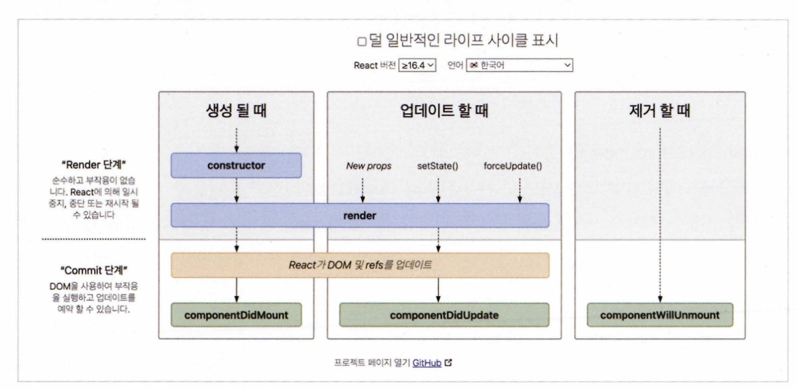
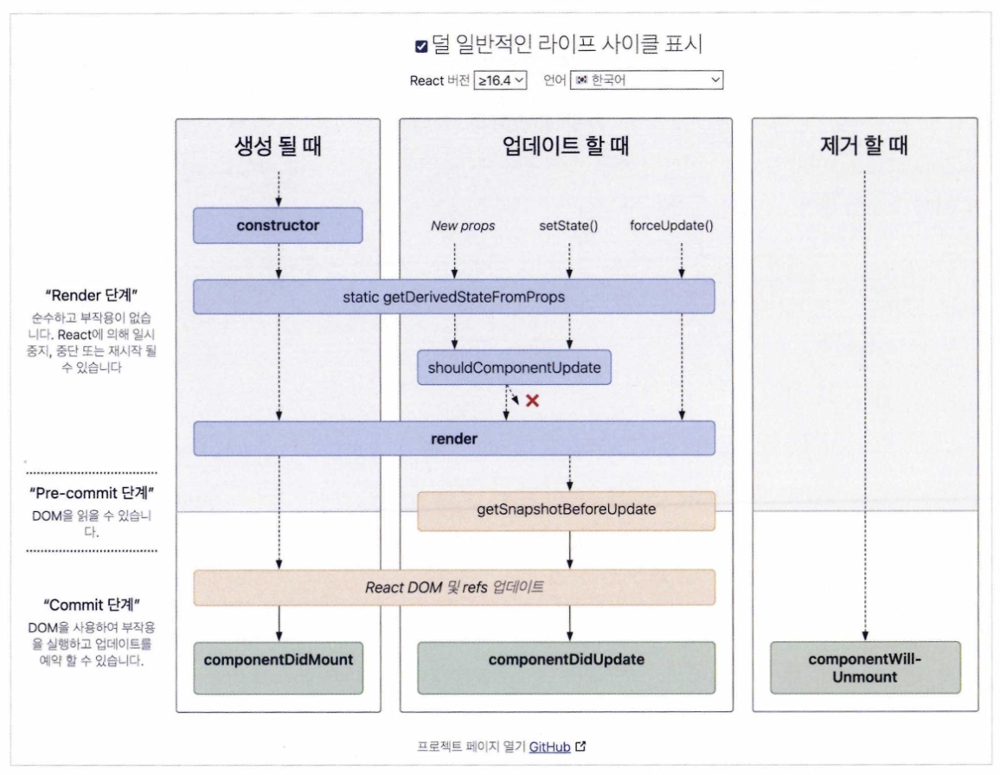

# 📚 [ 모던 리액트 딥다이브] - 02장 : 리액트 핵심 요소 깊게 살펴보기

## 2.1 JSX란?

JSX는 자바스크립트 코드 안에서 HTML과 유사한 문법을 사용할 수 있도록 고안된 문법 확장임.

JSX의 설계 목적은 UI를 트리 구조로 표현한 코드를 **트랜스파일러(Babel 등)**가 ECMAScript 형식의 자바스크립트 코드로 변환할 수 있게 하는 데 있음.

결과적으로 React는 이렇게 변환된 코드를 React.createElement() 형태로 실행하여 가상 DOM을 만들고 실제 DOM에 반영함.

## 2.1.1 JSX의 정의

### JSXElement

JSX를 구성하는 가장 기본적인 단위로, 하나의 요소를 의미함.

- `JSXOpeningElement`: 동일한 요소로 같은 단계에 선언돼 있어야 올바른 JSX문법임. (여는 태그)
  - ex: `<JSXElement JSXAttributes(optional)>`
- `JSXClosingElement`: JSXOpeningElement가 종료됐음을 알리는 태그. (닫는 태그)
  - ex: `</JSXElement>`
- `JSXSelfClosingElement``: 요소가 시작되고 스스로 종료되는 태그형태. 내부적으로 자식요소를 포함할 수 없음
  - ex: `<JSXElement JSXAttributes(optional)/>`
- `JSXFragment`: 아무 요소가 없는 형태. </>는 불가능함. <></>는 가능함.
  - ex: `<>JSXChilderen(optional)</>`

> HTML 태그명과 사용자가 만든 컴포넌트 태그명을 구분하기 위해 반드시 대문자로 컴포넌트를 만들어야 함.

### JSXElementName

JSX 요소 이름 자리에 올 수 있는 식별자를 의미함.

- JSXIdentifier : JSX 내부에서 사용 가능한 식별자. 숫자로 시작하거나 $나 \_ 외의 다른 특수문자로는 시작할 수 없음.

```jsx
function Valid1() {
  return <$></$>;
}

function Valid2() {
  return <_></_>;
}

// 불가능
function InValid() {
  return <1></1>;
}
```

- JSXNamespacedName : :를 이용해 네임스페이스를 분리하는 방식임. 두 개 이상은 불가능함.

```jsx
function valid() {
  return <foo:bar></foo:bar>;
}

// 두 개 이상의 식별자 묶기는 불가능
function invalid() {
  return <foo:bar:baz></foo:bar:baz>;
}
```

- JSXMemberExpression: .으로 식별자를 이어주는 방식임. 중첩도 가능하지만, :와 혼용할 수는 없음.

```jsx
function valid() {
  return <foo.bar></foo.bar>;
}

function valid2() {
  return <foo.bar.baz></foo.bar.baz>;
}

// 불가능
function invalid() {
  return <foo:bar.baz></foo:bar.baz>;
}
```

### JSXAttributes

JSX 요소에 속성(프로퍼티)을 부여할 수 있는 구조임. 존재하지 않아도 오류가 발생하지 않음.

- JSXSpreadAttributes : 자바스크립트 전개 연산자와 동일함.
  - {...AssignmentExpression}: 단순 객체뿐만 아니라 자바스크립트에서 AssignmentExpression으로 취급되는 모든 표현식이 존재할 수 있음. (조건문 표현식, 화살표 함수, 할당식..)
- JSXAttribute: 속성을 나타내는 키와 값으로 짝을 지어 표현. (키 - JSXAttributeName / 값 - JSXAttribute Value)

  - JSXAttributeName : 속성의 키 값. (JSXIdentifier, JSXNamespaced Name, : 를 이용하여 키 나타낼 수 있음.)

  ```jsx
    function valid1() {
        return <foo.bar foo:bar="baz"></foo.bar foo:bar="baz">
    }
  ```

  - JSXAttributeValue : key=value 형태의 속성을 의미함. (아래 중 하나를 만족해야 함.)

    - "" 큰따옴표로 구성된 문자열 : 자바스크립트 문자열과 동일
    - '' 작은 따옴표로 구성된 문자열 : 자바스크립트 문자열과 동일
    - {AssignmentExpression} : 자바스크립트에서 변수에 값을 넣을 수 있는 표현식은 JSX 속성 값으로도 가능
    - JSXElement: 값으로 다른 JSX요소가 들어갈 수 있음. 자주 사용하는 형태는 아님.
    - JSXFragment : 별도의 속성을 갖지 않는 빈 태그가 들어갈 수 있음.

    ```jsx
    function Child({ attribute }) {
      return <div>{attribute}</div>;
    }

    export default function App() {
      return (
        <div>
          <Child attribute=<div>hello</div> />
        </div>
      );
    }
    ```

### JSXChildren

JSXElement의 자식 값을 나타냄.

- JSXChild: JSXChildren을 이루는 기본 단위. JSXChildren은 JSXChild를 0개 이상 가질 수 있음.

  - JSXText : {, < , >, } 를 제외한 문자열.

  ```jsx
  function valid(){
    return <>{'{}'<>'}</>
  }
  ```

  - JSXElement: 값으로 다른 JSX 요소가 들어갈 수 있음.
  - JSXFragment: 값으로 빈 태그가 들어갈 수 있음.
  - { JSXChildExpression (optional) } : 자바스크립트의 AssignmentExpression을 의미함.

  ```jsx
  // 이 함수를 리액트에서 렌더링하면 foo 문자열 출력
  export default function App() {
    return <>{(() => "foo")()}</>;
  }
  ```

### JSXStrings

JSX 내부에서 문자열은 ", '로 감쌀 수 있음. 특수문자를 표현할 때는 \ 이스케이프 문자를 사용함.

```jsx
// \ 사용 문제 없음.
<button>\</button>

// Invalid or unexpected token
let escape1 = "\";

// valid
let escape2 = "\\"
```

## 2.1.2 JSX 예제

[ 유효한 JSX]

```jsx
// 하나의 요소
const ComponentA = <A>하이.</A>;

// 자식 없이 self closing
const ComponentB = <A />;

// 옵션을 {}와 스프레드 연산자로 넣을 수 있음
const ComponentC = <A {...{ required: true }} />;

// 속성만 넣어도 가능
const componentD = <A required />;

// 속성 & 속성값
const ComponentE = <A required={false} />;

const ComponentF = (
  <A>
    {/* 문자열은 큰 따옴표, 작은 따옴표 모두 가능 */}
    <B text="리액트" />
  </A>
);

const ComponentG = (
  <A>
    {/* 옵션 값으로 JSXElement 넣기도 가능 */}
    <B optionalChildren={<>안녕</>} />
  </A>
);

const ComponentH = (
  <A>
    {/* 여러 개의 자식도 포함 */}
    안녕
    <B text="리액트" />
  </A>
);
```

```jsx
function ComponentA() {
  return <A.B></A.B>;
}

function ComponentB() {
  return <A.B.C> </A.B.C>;
}

function ComponentC() {
    return <A:B:C> </A:B:C>
}

function ComponentD() {
    return <$></$>
}

function ComponentE() {
    return <_></_>
}
```

## 2.1.3 JSX는 어떻게 자바스크립트에서 변환될까?

JSX는 자바스크립트가 직접 이해할 수 없기 때문에, **Babel 플러그인(@babel/plugin-transform-react-jsx)**을 사용해 React.createElement 형식으로 변환함.

### (React 16 이하 버전)

```jsx
const ComponentA = <A required={true}>HeUo World</A>;

const ComponentB = <>Hello World</>;

const ComponentC = (
  <div>
    <span>hello world</span>
  </div>
);
```

`@babel/plugin-transform-react-jsx`를 사용하여 코드를 변환하면 아래와 같은 결과가 나옴.

```jsx
"use strict";

var ComponentA = React.createElement(
  A,
  {
    required: true,
  },
  "Hello World"
);
var Components = React.createElement(React.Fragment, null, "Hello World");
var ComponentC = React.createElement(
  "div",
  null.React.createElement("span", null, "hello world")
);
```

### (React 17 이상, 자동 런타임)

```jsx
"use strict";
var _jsxRuntime = require("custom-jsx-library/jsx-runtime");
var ComponentA = (0, _jsxRuntime.jsx)(A, {
  required: true,
  children: "HeUo World",
});
var ComponentsB = (0, _jsxRuntime.jsx)(_jsxRuntime.Fragment, {
  children: "Hello World",
});
var ComponentC = (0, _jsxRuntime.jsx)("div", {
  children: (0, _jsxRuntime.jsx)("span", {
    children: "hello world",
  }),
});
```

### 직접 해보기

```jsx
import * as Babel from "@babel/standalone";

Babel.registerPlugin(
  "@babel/plugin-transform-react-jsx",
  require("@babel/plugin-transform-react-jsx")
);
const BABEL_CONFIG = {
  presets: [],
  plugins: [
    [
      "@babel/plugin-transform-react-jsx",
      {
        throwIfNamespace: false,
        runtime: "automatic",
        importsource: "custom-jsx-library",
      },
    ],
  ],
};

const SOURCE_CODE = "const ComponentA = <A>안녕하세요.</A>";
// code 변수에 트랜스파일된 결과가 담긴다.
const { code } = Babel.transform(S0URCE_C0DE, BABEL_CONFIG);
```

JSXElement를 첫 번째 인수로 선언하여 요소를 정의하고, 옵셔널인 JSXChildren, JSXAttributes, JSXStrings는 이후 인수로 넘겨주어 처리함. 경우에 따라 다른 JSXElement를 렌더링해야할 때 요소 전체를 감싸지 않더라도 처리할 수 있음.

```jsx
import { createElement, PropsWithChildren } from "react";

// X : props 여부에 따라 children 요소만 달라지는 경우
// 굳이 번거롭게 전체 내용을 삼항 연산자로 처리할 필요가 없다.
// 이 경우 불필요한 코드 중복이 일어난다.
function TextOrHeading({
  isHeading,
  children,
}: PropsWithChildren<{ isHeading: boolean }>) {
  return isHeading ? (
    <hl className="text">{children}</hl>
  ) : (
    <span className="text">{children}</span>
  );
}
// O : JSX가 변환되는 특성을 활용한다면 다음과 같이 간결하게 처리할 수 있다.
import { createElement } from "react";
function TextOrHeading({
  isHeading,
  children,
}: PropsWithChildren<{ isHeading: boolean }>) {
  return createElement(
    isHeading ? "hl" : "span",
    { className: "text" },
    children
  );
}
```

> JSX는 결국 React.createElement() 함수로 변환되기 때문에, 동적으로 요소를 선택해 렌더링하는 것이 가능함.
>
> JSXNamespacedName과 JSXMemberExpression은 사용하지 않음. createElement를 사용하여 컴포넌트를 구성하는 것도 효율적일 수 있음.

## 2.2 가상 DOM과 리액트 파이버

## 2.2.1 DOM과 브라우저 렌더링 과정

**DOM(Document Object Model)**은 HTML, XML 문서를 트리 형태로 구조화한 객체 모델임.
웹 브라우저는 이 DOM을 이용해 웹페이지를 구성하고, 자바스크립트는 DOM API를 통해 이 구조를 조작함.

즉, DOM은 웹페이지의 콘텐츠와 구조에 대한 인터페이스임. 브라우저는 DOM을 기반으로 화면에 어떤 요소를 어떻게 보여줄지 결정함.

### 브라우저 렌더링 과정

1. HTML 파일 다운로드

브라우저는 사용자가 URL을 입력하거나 링크를 클릭했을 때, 서버에 요청을 보내고 HTML 파일을 다운로드함.
이 파일은 단순한 텍스트 파일로, 브라우저는 이를 분석해서 화면에 표시할 구조로 바꿔야 함.

2. HTML 파싱 → DOM 트리 생성

브라우저의 렌더링 엔진은 HTML을 위에서부터 한 줄씩 **파싱(분석)**하며, 이를 기반으로 DOM 트리를 구성함.
DOM 트리는 HTML 요소 간의 부모-자식 관계를 계층적으로 표현한 트리 구조임.

3. CSS 파일 다운로드

HTML을 파싱하는 중 `<link>` 또는 `<style>` 태그를 만나면, 브라우저는 외부 CSS 파일을 비동기적으로 다운로드함.
이때 CSS는 JavaScript와 달리 렌더링 차단 리소스이기 때문에 CSS 다운로드 및 파싱이 완료될 때까지 페이지 렌더링이 멈출 수 있음.

4. CSS 파싱 → CSSOM 트리 생성

다운로드된 CSS는 파싱되어 **CSSOM(CSS Object Model)**이라는 별도의 트리 구조로 변환됨.
이 트리는 각 HTML 요소에 어떤 스타일이 적용돼야 하는지를 구조적으로 표현한 것임.

5. DOM + CSSOM → Render Tree 생성

렌더링 엔진은 DOM 트리와 CSSOM 트리를 결합하여 Render Tree를 생성함.
Render Tree는 실제로 화면에 보여질 노드만 포함하며, display: none 같은 보이지 않는 요소는 Render Tree에 포함되지 않음.

6. Layout (Reflow)

Render Tree가 완성되면, 브라우저는 각 요소가 화면의 어디에 위치해야 할지 계산하는 작업을 수행함.
이 과정을 **Layout 단계(또는 Reflow)**라고 부름.

7. Painting (그리기)

Layout 단계를 마친 요소에 색상, 그림자, 테두리, 배경 이미지 등 시각적 스타일을 적용하는 과정임.
이 과정을 Painting이라고 부름. 실제 픽셀 단위로 그리기 작업이 일어남.

## 2.2.2 가상 DOM의 탄생 배경

브라우저의 렌더링 구조를 보면, 단순히 요소의 색상만 변경되는 경우에는 페인팅(Painting) 작업만 수행되기 때문에 비교적 빠르게 처리할 수 있음. 하지만 요소의 크기나 위치, 노출 여부가 변경되는 경우에는 그 요소뿐 아니라 하위 요소 전체에 대해 **레이아웃(Layout, 또는 Reflow)**과 **페인팅(Painting)**이 다시 수행돼야 함.

특히 DOM 트리에서 변경이 발생한 요소가 많은 자식 요소를 포함하고 있는 경우, 하위 노드들도 함께 재계산해야 하므로 브라우저와 CPU, 메모리에 많은 렌더링 비용이 발생하게 됨. 이런 상황은 사용자 인터랙션이 많거나 UI가 복잡한 앱일수록 빈번하게 발생함.

SPA(Single Page Application) 구조에서는 사용자가 다른 페이지로 이동할 때마다 전체 페이지를 새로 로드하는 방식이 아니라, 자바스크립트를 통해 필요한 요소만 부분적으로 갱신함. 이 덕분에 페이지 간 이동이 빠르고 깜빡임 없는 전환이 가능함.

하지만 문제는, 라우팅이 변경될 때마다 **화면의 대부분 요소(본문, 콘텐츠 등)**를 제거하고 새로 삽입하며, 그에 따라 위치와 크기를 재계산하는 렌더링 작업이 반복적으로 수행된다는 점임.
사이드바, 헤더 등 고정된 레이아웃을 제외한 대부분 영역이 빈번히 갱신되며, 이로 인해 DOM 조작에 대한 부담이 커지게 됨.

DOM을 직접 조작하는 개발자 입장에서는, 사용자의 인터랙션에 따라 일어나는 모든 상태 변화를 수동으로 추적하고 DOM을 일일이 관리하는 것이 복잡하고 오류가 발생하기 쉬움.

개발자는 "이 인터랙션의 결과로 만들어질 최종 DOM 상태가 무엇인가?" 만 알면 됨. 그 중간 변경 과정을 일일이 신경 쓰기보다, 결과적으로 어떤 UI가 보여야 하는지만 선언적으로 기술할 수 있다면 훨씬 생산적임.

가상 DOM은 실제 브라우저 DOM이 아니라, 리액트 내부에서 메모리 상에 유지되는 DOM의 추상적 표현을 의미함.
즉, 리액트는 매 렌더링마다 DOM을 직접 수정하는 것이 아니라, 먼저 가상 DOM에 변경 사항을 적용하고, 변경이 끝난 후에야 필요한 최소한의 변경만 실제 브라우저 DOM에 반영함.

브라우저가 아닌 메모리 상에서 계산을 수행하기 때문에 렌더링에 드는 비용이 적고, 변경된 부분만 실제 DOM에 반영하여, 불필요한 렌더링을 방지할 수 있음.

## 2.2.3 가상 DOM을 위한 아키텍처, 리액트 파이버

### 리액트 파이버?

**파이버(Fiber)**는 React 16부터 도입된 새로운 조정(Reconciliation) 엔진임.

React 15까지는 재귀 기반의 스택 구조를 이용해 DOM 변경을 처리했음. 자바스크립트가 싱글 스레드로 동작하기 때문에 하나의 작업이 시작되면 끝날 때까지 다른 작업을 수행할 수 없음. 그렇기 떄문에 렌더링 작업이 길어질수록 UX가 나빠짐.

파이버는 이를 비동기적이며 점진적으로 처리할 수 있도록 개선한 구조임.

파이버는 fiber reconciler가 관리함. 이 reconciler는 앞서 설명한 **가상 DOM(Virtual DOM)**과 실제 DOM을 비교하여 변경사항이 있는지 확인하고,
차이가 있다면 해당 변경 정보를 담고 있는 “파이버 객체”를 기반으로 실제 DOM에 변경을 요청함.

=> 파이버는 어떤 요소가 변경됐는지, 어떻게 렌더링해야 할지, 언제 작업을 처리할지를 결정하는 단위임.

파이버는 전체 렌더링 작업을 **작은 작업 단위(단위 fiber)**로 쪼갬.
이렇게 하면 각 작업에 **우선순위(priority)**를 부여할 수 있고,
중요한 작업부터 먼저 처리하거나, 덜 중요한 작업은 나중으로 미루거나 중단할 수 있음.

파이버는 전체 렌더링 작업을 FiberNode라는 객체 단위로 쪼개서 수행함.
각 FiberNode는 특정 컴포넌트, DOM 요소, 혹은 그와 관련된 정보를 하나씩 가지고 있는 작업 단위임.

[ 실제 파이버 객체 코드 ]

```jsx
function FiberNode(
  tag: WorkTag,
  pendingProps: mixed,
  key: null | string,
  mode: TypeOfMode,
) {
  // Instance
  this.tag = tag; // 1:1 관계 매칭 정보
  this.key = key; // 컴포넌트 식별 값
  this.elementType = null;
  this.type = null;
  this.stateNode = null; // 객체에 대한 참조 값

  // Fiber
  this.return = null; // 부모 FiberNode
  this.child = null; // 첫 번째 자식 FiberNode
  this.sibling = null; // 형제 FiberNode
  this.index = 0; // 형제 FiberNode 구분 요소

  this.ref = null; // DOM요소에 접근할 수 있는 참조값
  this.refCleanup = null; // 언마운트 시 cleanup 함수

  this.pendingProps = pendingProps; // 처리하지 못한 props 저장
  this.memoizedProps = null; // 렌더링이 완료되면 memoizedProps로 옮겨감
  this.updateQueue = null; // 상태 업데이트, 콜백 함수 등 필요한 작업을 담아두는 큐
  this.memoizedState = null; // 함수 컴포넌트의 훅 목록
  this.dependencies = null; // 반대편 트리

  this.mode = mode;

  // Effects
  this.flags = NoFlags; // 노드에서 수행하는 작업을 나타내는 flag
  this.subtreeFlags = NoFlags; // 하위 트리에서 발생해야 하는 작업
  this.deletions = null; // 삭제해야하는 자식 노드 목록 관리

  this.lanes = NoLanes; // 작업 우선순위 추적
  this.childLanes = NoLanes; // 하위 트리 작업들의 우선순위 추적

  this.alternate = null;
  ...
}
```

리액트는 컴포넌트를 파싱하면서 **Fiber 트리(Fiber Tree)**를 생성함.
각 컴포넌트는 하나의 FiberNode로 표현되며, 부모-자식-형제로 이어지는 링크드 리스트 기반 구조를 가짐.

이 구조 덕분에 리액트는 트리를 반복문처럼 순회할 수 있고, 작업을 중간에 끊거나 재개할 수 있음.

1️⃣ 렌더 단계 (Render Phase)

- 사용자가 화면에서 볼 수 없는 비동기적인 준비 단계임. 리액트는 새롭게 구성된 Fiber 트리를 만들고, 어떤 작업이 필요한지를 기록하고, 이 과정에서 실제 DOM 변경은 일어나지 않음.

각 작업은 우선순위에 따라서 계속 진행하거나 / 중단 / 건너뛰기 / 재시작 을 할 수 있음.

2️⃣ 커밋 단계 (Commit Phase)

- 렌더 단계에서 준비된 finishedWork를 바탕으로 실제 브라우저 DOM에 반영하는 작업을 수행함. commitWork()가 실행되며, DOM 삽입, 업데이트, 제거 등 가시적인 변경이 이루어짐. 이 단계는 동기적으로 실행되며, 중단이 불가능함.

상태가 바뀔 때마다 새로 생성되는 리액트 엘리먼트와 다르게 성능 최적화를 위해 파이버는 컴포넌트가 최초 마운트 되는 시점에 생성되어 이후에는 되도록 재사용하려고 함.

### 리액트 파이버 트리

1. current:

- 화면에 표시되고 있는 현재 상태의 트리임.
- 사용자에게 실제로 보여지고 있는 UI를 나타냄. 2. workInProgress:
- 업데이트를 적용 중인 작업용 트리임.
- 변경 사항이 적용되는 중이며, 아직 사용자에게는 보이지 않음.

2. workInProgress:

- 업데이트를 적용 중인 작업용 트리임.
- 변경 사항이 적용되는 중이며, 아직 사용자에게는 보이지 않음.

리액트는 업데이트가 발생하면 current 트리를 두고, 복사된 workInProgress 트리에서 새로 계산을 시작함. 작업이 완료되면 두 트리 포인터만 교체하여 새로운 트리가 화면에 나타남. (== 더블 버퍼링)

**더블 버퍼링**은 사용자에게 보여지는 프레임은 하나지만, 실제로는 백그라운드에서 다음 프레임을 미리 그려두고, 준비가 끝나면 한 번에 바꿔치기하는 방식임.

### 더블 버퍼링 흐름

1. 렌더링이 시작되면, 현재 화면에 표시 중인 트리는 current
2. 상태 변경(setState 등)이 발생하면, current 트리를 복사하여 workInProgress 트리를 생성
3. workInProgress 트리에서 새로운 변경 사항을 적용하고, 렌더링을 준비
4. 이 작업이 완료되면 **커밋 단계(commit phase)**에서
   - 실제 DOM에 필요한 변경 사항을 반영함 (commitWork() 등)
   - 그 후, current 포인터를 workInProgress로 교체함 (새로운 트리가 화면에 표시)

이 과정을 통해 렌더링 중에도 사용자 경험에 영향을 주지 않고 매끄러운 UI 갱신이 가능해짐.

### 파이버의 작업 순서

**[ 파이버 노드의 생성 흐름 ]**

1. 리액트는 `beginWork()` 함수를 실행하여 파이버 작업을 수행하는데, 더 이상 자식이 없는 파이버를 만날 때까지 트리 형식으로 시작
2. 1번 작업이 끝나면 그다음 `completeWork()` 함수를 실행하여 파이버 작업을 완료함
3. 형제가 있으면 형제로 넘어감
4. 2,3번이 끝나면 `return` 으로 돌아가서 자신의 작업이 완료됐음을 알림

최초 렌더링 시에는 모든 파이버 노드를 처음부터 새로 생성해야 했음.
하지만 이후 업데이트가 발생하면, 리액트는 기존의 current 파이버 트리를 복사하여 workInProgress 트리를 **“재사용”**하는 방식으로 처리함.

리액트는 기존 파이버의 alternate 속성을 활용하여 current 트리와 workInProgress 트리는 연결되어 동작하고, 업데이트가 필요한 경우에 기존 파이버의 내부 속성값만 초기화하거나 바꾸는 형태로 트리를 업데이트 함. (=> 메모리 사용을 줄이고 비교 비용을 낮추는데 효과적임)

업데이트는

1. setState 같은 상태 변경 함수가 호출되면
2. 현재 화면에 표시 중인 current 트리를 기반으로 새로운 workInProgress 트리를 빌드함
3. 최초 렌더링처럼 동작하지만, 기존 파이버 객체를 재사용하고 + 필요한 속성만 업데이트

기존 리액트(React 15 이하)에서는 DOM 업데이트 작업을 동기적으로 한 번에 처리했음.
이 과정은 재귀 함수로 트리를 순회하며 새로운 DOM 구조를 생성했기 때문에, UI가 멈추거나 응답이 느려짐.

파이버 구조는 작은 작업 단위 (파이버 노드)로 처리하고, 각 작업에 우선순위가 부여된다.
중요한 작업 (사용자 클릭, 입력)은 즉시 처리해야 하기 때문에 높은 우선순위로 설정하고, 비교적 덜 중요한 작업(렌더링, 이미지 로딩 등)은 낮은 우선순위로 처리함.

## 2.2.4 파이버와 가상 DOM

리액트 컴포넌트 정보를 1:1로 가지고 있는 것이 파이버이기 때문에 리액트 아키텍처 내부에서 비동기로 이루어짐.
비동기 작업과 달리, 실제 브라우저 구조 DOM에 반영하는 건 동기적으로 일어나야 하고, 처리하는 작업이 많아 화면에 불완전하게 표시될 수 잇는 가능성이 높은건 가상에서 (== 메모리 상) 먼저 수행해서 최종적인 결과물만 실제 브라우저 DOM에 적용함.

## 2.3 클래스 컴포넌트와 함수 컴포넌트

## 2.3.1 클래스 컴포넌트

리액트의 클래스형 컴포넌트는 React.Component 또는 React.PureComponent를 extends하여 정의함. props와 state의 타입을 각각 제네릭으로 넘김

- constructor()에서 super(props)를 호출해야 상위 컴포넌트 생성자가 먼저 실행됨
- state는 반드시 객체 형태로 정의하며, setState()를 통해 변경해야 렌더링이 다시 발생함

```jsx
import React from 'react'

// props 타입 선언 (- 컴포넌트에 특정 속성을 전달하는 용도)
interface SampleProps {
  required?: boolean
  text: string
}

// state 타입 선언 (- 클래스 컴포넌트 내부에서 관리하는 값. 객체여야 함. 값 변화가 있을 때마다 리렌더링 발생)
interface SampleState {
  count: number
  isLimited?: boolean
}

// 클래스 컴포넌트 정의
class SampleComponent extends React.Component<SampleProps, SampleState> {
    // 내부에 생성자 함수가 있으면 컴포넌트가 초기화되는 시점에 호출함.
  constructor(props: SampleProps) {
    super(props) // 컴포넌트를 만들면서 상속 받은 상위 React.Component의 생성자 함수를 먼저 호출하여 상위에 접근
    this.state = {
      count: 0,
      isLimited: false,
    }
  }

  // 클릭 핸들러
  private handleClick = () => {
    const newValue = this.state.count + 1
    this.setState({
      count: newValue,
      isLimited: newValue >= 10,
    })
  }

  // 렌더 함수
  public render() {
    const { required, text } = this.props
    const { count, isLimited } = this.state

    return (
      <div>
        <h2>Sample Component</h2>
        <div>{required ? '필수' : '필수 아님'}</div>
        <div>문자: {text}</div>
        <div>count: {count}</div>
        <button onClick={this.handleClick} disabled={isLimited}>
          증가
        </button>
      </div>
    )
  }
}

export default SampleComponent
```

### 클래스 컴포넌트의 생명주기 메서드

리액트 클래스 컴포넌트는 컴포넌트의 생성부터 소멸까지 특정 시점에 자동으로 호출되는 **생명주기 메서드(Lifecycle Methods)**를 가짐.

1. **마운트 Mount** : 처음으로 DOM에 나타내는 시점
2. **업데이트 Update** : 이미 생성된 컴포넌트 내용이 props나 state 변경으로 인해 다시 렌더링되는 시점
3. **언마운트 Unmount** : 컴포넌트가 더 이상 존재하지 않는 시점

**`render()`**

- 컴포넌트가 렌더링될 때 실행됨 (마운트 + 업데이트 단계 모두 해당)
- 항상 순수 함수처럼 동작해야 하며, 부수 효과가 있으면 안 됨
- 내부에서 this.setState() 호출 금지
- 동일한 props, state가 들어가면 항상 동일한 JSX 반환해야 함

**`componentDidMount()`**

- 마운트 이후 실행됨
- DOM 접근 또는 API 호출 등 부수 효과 작업을 수행할 수 있음
- 내부에서 this.setState() 호출 가능 (한 번 더 렌더링 발생함)

**`componentDidUpdate()`**

- 업데이트 후 실행됨 (렌더링 후)
- this.setState() 사용 가능하지만 조건문 필수
- 조건 없이 사용하면 무한 루프 발생 위험 있음

```jsx
componentDidUpdate(prevProps: Props) {
  if (this.props.userName !== prevProps.userName) {
    this.fetchData(this.props.userName);
  }
}
```

**`componentWillUnmount()`**

- 컴포넌트가 화면에서 제거되기 직전에 호출됨
- 타이머 정리, 이벤트 해제, API 구독 해지 등 정리(clean-up) 작업 수행
- 내부에서 this.setState() 사용 불가

```jsx
componentWillUnmount() {
  window.removeEventListener('resize', this.resizeListener)
  clearInterval(this.intervalId)
}
```

**`shouldComponentUpdate()`**

- 렌더링 여부를 결정하는 메서드 (true 반환 시 리렌더링)
- 기본값은 항상 true
- 성능 최적화 목적일 때만 사용 권장

```jsx
shouldComponentUpdate(nextProps, nextState) {
  return this.props.title !== nextProps.title || this.state.input !== nextState.input
}
```

React.PureComponent는 이 메서드를 기본으로 구현한 컴포넌트임 (얕은 비교만 수행)

**`static getDerivedStateFromProps()`**

- static 메서드로 this에 접근할 수 없음
- props 변화에 따라 state를 동기적으로 업데이트할 수 있음
- 반환값이 null이면 state 변경 없음

```jsx
static getDerivedStateFromProps(nextProps, prevState) {
  if (nextProps.name !== prevState.name) {
    return { name: nextProps.name };
  }
  return null;
}
```

**`getSnapShotBeforeUpdate()`**

- DOM 업데이트 직전에 실행됨
- 반환된 값은 componentDidUpdate()의 세 번째 인자로 전달됨
- 스크롤 위치, 윈도우 사이즈 등 기록에 유용함

```jsx
getSnapshotBeforeUpdate(prevProps, prevState) {
  if (prevProps.list.length < this.props.list.length) {
    const list = this.listRef.current;
    return list.scrollHeight - list.scrollTop;
  }
  return null;
}

componentDidUpdate(prevProps, prevState, snapshot) {
  if (snapshot !== null) {
    const list = this.listRef.current;
    list.scrollTop = list.scrollHeight - snapshot;
  }
}
```



**`getDerivedStateFromError()`**

- 하위 컴포넌트에서 오류가 발생했을 때 실행됨
- 반환된 state를 기반으로 오류 UI를 렌더링함
- 내부에서 부수 효과 사용 불가 (오직 state 반환만 허용)

```jsx
static getDerivedStateFromError(error) {
  return { hasError: true };
}
```

**`componentDidCatch`**

- 오류 발생 시, 추가적인 부수 효과 작업을 수행할 수 있음
- 에러 로깅, 서버로 에러 정보 전송 등에 사용

```jsx
componentDidCatch(error, info) {
logErrorToService(error, info);
}
```

### 클래스 컴포넌트 한계

- 데이터 흐름을 추적하기 어려움
- 애플리케이션 내부 로직 재사용 어려움
- 기능이 많아질수록 컴포넌트 크기가 커짐
- 함수에 비해 어려움
- 핫리로딩 하는 데 상대적으로 불리함 (코드 수정 내용이 바로 반영)

> 클래스 컴포넌트는 최초 렌더링 시에 instance를 생성하고, 내부에서 state를 관리함. 내부 render를 수정하게 되면 수정 반영하기 위해서는 instance를 새로 만들어야만 함.

## 2.3.2 함수 컴포넌트

```jsx
import { useState } from 'react'

// props 타입 정의
type SampleProps = {
  required?: boolean
  text: string
}

// 함수 컴포넌트 정의
export function SampleComponent({ required, text }: SampleProps) {
  const [count, setCount] = useState<number>(0)
  const [isLimited, setIsLimited] = useState<boolean>(false)

  function handleClick() {
    const newValue = count + 1
    setCount(newValue)
    setIsLimited(newValue >= 10)
  }

  return (
    <div>
      <h2>Sample Component</h2>
      <div>{required ? '필수' : '필수 아님'}</div>
      <div>문자: {text}</div>
      <div>count: {count}</div>
      <button onClick={handleClick} disabled={isLimited}>
        증가
      </button>
    </div>
  )
}
```

1. this를 사용하지 않음

클래스 컴포넌트에서는 this.props, this.state, this.handleClick 등으로 접근해야 하지만
함수 컴포넌트는 props를 함수 인자로 바로 받고, 상태는 useState를 통해 직접 선언해서 사용할 수 있음.
따라서 this 바인딩 문제를 신경 쓰지 않아도 됨.

2. 코드가 간결하고 직관적임

컴포넌트 구조가 일반 함수와 비슷하고, 상태나 이벤트 핸들러도 함수 내부에서 바로 정의할 수 있어 전체적인 코드 양이 줄고 가독성이 좋아짐.

3. state를 객체가 아닌 개별 값으로 관리할 수 있음

클래스 컴포넌트에서는 상태를 하나의 객체로 정의하고 그 안에서 count, isLimited 등을 관리해야 하지만,
함수 컴포넌트에서는 각각 useState(0), useState(false)처럼 원시값 단위로 독립적인 상태를 관리할 수 있음.
이 방식은 코드 유지보수에 유리하고, 상태 업데이트도 명확함.

4. 생명주기 메서드 대신 훅을 사용함

componentDidMount, componentDidUpdate, componentWillUnmount 같은 생명주기 메서드는 클래스 컴포넌트에서만 존재함.
함수 컴포넌트에서는 useEffect() 하나로 이 모든 역할을 처리할 수 있음.
조건과 의존성 배열을 설정하여 어떤 시점에 어떤 동작을 할지 쉽게 제어할 수 있음. 5. 함수 정의 방식이 자유로움
클래스 컴포넌트는 메서드를 정의할 때 바인딩 문제를 피하기 위해 화살표 함수로 작성하거나, bind()를 사용해야 하는 번거로움이 있었음.
함수 컴포넌트에서는 단순히 함수 내부에 function handleClick() {}처럼 작성하면 되므로 훨씬 깔끔함.

## 2.3.3 함수 컴포넌트 vs 클래스 컴포넌트

### 생명주기 메서드의 부재

클래스 컴포넌트는 React.Component를 상속받는 자바스크립트 클래스이기 때문에, componentDidMount, componentDidUpdate 등 명시적인 생명주기 메서드가 존재함.

반면 함수 컴포넌트는 클래스가 아니기 때문에 이러한 생명주기 메서드가 기본적으로 존재하지 않음.
대신 useEffect() 훅을 통해 비슷한 타이밍에 동작을 구현할 수 있음.

다만, useEffect는 생명주기 메서드를 흉내 내는 도구이지, 생명주기 전용 훅은 아님.
의존성 배열 설정을 통해 mount, update, unmount 시점을 조절하는 방식임.

### 함수 컴포넌트와 렌더링된 값

함수 컴포넌트와 클래스 컴포넌트는 **렌더링된 값(props)**에 대해 동작 방식이 다름.

```jsx
import React from "react";
interface Props {
  user: string;
}
// 함수 컴포넌트
export function FunctionalComponent(props: Props) {
  const showMessage = () => {
    alert("Hello " + props.user);
  };

  const handleClick = () => {
    setTimeout(showMessage, 3000);
  };

  return <button onClick={handleClick}>Follow</button>;
}
```

```jsx
// 클래스 컴포넌트
export class ClassComponent extends React.Component<Props, {}> {
  private showMessage = () => {
    alert('Hello ' + this.props.user);
  }

  private handleClick = () => {
    setTimeout(this.showMessage, 3000);
  }

  public render() {
    return <button onClick={this.handleClick}>Follow</button>
  }
}
```

- 함수 컴포넌트: 버튼을 클릭한 그 시점의 props.user 값이 3초 뒤에도 그대로 사용됨.

  → 함수가 렌더링 당시의 값을 폐쇄된 클로저로 기억하고 있기 때문임.

- 클래스 컴포넌트: 3초가 지난 후 실행되는 this.showMessage()는 현재 this.props.user 값을 참조함.

  → this가 가리키는 객체는 항상 최신 상태이므로, 그 사이에 props가 바뀌면 최신 값이 반영됨.

함수 컴포넌트의 showMessage 함수는 렌더링될 때마다 새롭게 정의되며, 렌더링 당시의 props를 클로저로 가둬둠

클래스 컴포넌트의 this.props는 항상 현재 인스턴스를 참조하기 때문에 최신 값에 접근하게 됨

## 2.4 렌더링은 어떻게 일어나는가?

## 2.4.1 리액트의 렌더링이란?

리액트에서 렌더링이란, 애플리케이션 트리 안에 있는 모든 컴포넌트들이 현재의 props와 state 값을 바탕으로 UI를 계산하고, 브라우저가 그릴 수 있는 DOM 구조를 생성하는 과정을 의미함.

컴포넌트가 반환하는 JSX는 결국 React.createElement를 통해 자바스크립트 객체로 변환되고, 이를 바탕으로 가상 DOM이 만들어짐.
이 가상 DOM은 리액트 내부에서 비교(diff)되고, 변경이 필요한 부분만 실제 브라우저 DOM에 반영됨.

렌더링은 UI를 새로 그리는 전체 과정이 아니라, UI를 계산하고 가상 DOM을 구성하는 과정을 뜻함.

## 2.4.2 리액트 렌더링이 일어나는 이유

1. 최초 렌더링 (Initial Rendering)

   - 리액트 애플리케이션이 처음 브라우저에 로드될 때 발생함
   - 이 시점에 props와 state가 주어지면, 컴포넌트는 이를 기반으로 처음 UI를 구성함

2. 리렌더링 (Re-rendering)
   - 최초 렌더링 이후, 특정 상태 변화가 발생할 때마다 다시 렌더링이 일어남
   - 리렌더링은 전체 트리를 다시 그리는 것이 아니라, 필요한 컴포넌트만 부분적으로 갱신함

**리렌더링이 발생하는 상황**

1. 클래스 컴포넌트에서 this.setState() 호출 시
   - 내부 상태(state)가 변경되면 해당 컴포넌트가 리렌더링됨
   - 변경된 state에 따라 UI를 다시 계산함
2. 클래스 컴포넌트에서 this.forceUpdate() 호출 시
   - 일반적으로는 사용하지 않지만, props/state 외의 값이 UI에 영향을 줄 때 강제로 렌더링을 유도할 수 있음
   - forceUpdate()는 shouldComponentUpdate()를 무시하고 강제로 렌더링을 수행함
   - 이로 인해 하위 컴포넌트들까지 모두 리렌더링되는 부작용이 있을 수 있음
3. 함수 컴포넌트에서 useState()의 setter 함수 실행 시
   - 예: setCount(newCount)처럼 상태를 변경하면 리렌더링이 발생함
4. 함수 컴포넌트에서 useReducer()의 dispatch 실행 시
   - 예: dispatch({ type: 'INCREMENT' })처럼 상태를 갱신하면 렌더링이 일어남
   - 내부적으로 useState와 유사하게 동작함
5. 컴포넌트의 key props 변경 시
   - key는 리스트 렌더링 등에서 각 컴포넌트를 고유하게 식별하기 위한 특수한 props임
   - key 값이 변경되면 해당 컴포넌트는 완전히 새로운 컴포넌트로 인식되며, 기존 컴포넌트는 언마운트 → 새로운 컴포넌트는 마운트 과정을 다시 거침

## 2.4.3 리액트의 렌더링 프로세스

렌더링 프로세스가 시작되면, 리액트는 루트 컴포넌트부터 트리를 따라 하위 컴포넌트까지 내려가며 렌더링이 필요한 컴포넌트를 탐색함.

업데이트가 필요한 컴포넌트를 발견하면,

- *클래스 컴포넌트*의 경우 **render()** 메서드를 호출하고,
- *함수 컴포넌트*의 경우 함수 자체를 호출하여 **렌더링 결과(JSX)**를 반환받음.

이렇게 수집된 각 컴포넌트의 렌더링 결과를 바탕으로 새로운 가상 DOM 트리가 구성됨.
이후 리액트는 이 새로운 가상 DOM과 기존 가상 DOM을 비교하여 실제 DOM에 반영해야 할 변경 사항들만 선별함.

모든 비교(diffing)와 계산이 끝난 뒤에는, 변경된 내용을 **동기적**으로 실제 브라우저 DOM에 반영하여 화면에 변화가 나타나게 됨.

## 2.4.4 렌더와 커밋



**렌더 단계**는 컴포넌트를 실행하고, 변경 사항을 계산하는 과정임. (실제 DOM에 아무 작업 하지 않음)

1. 루트 컴포넌트부터 트리를 순회하며 모든 자식 컴포넌트를 실행
2. 실행 결과로 얻은 JSX를 바탕으로 새로운 가상 DOM을 생성
3. 이전 가상 DOM과 비교하여 변경이 필요한 컴포넌트를 식별

type(컴포넌트 종류), props(속성 값), key(리스트 컴포넌트 고유성 보장) 이 3가지를 비교하고 하나라도 다르면 해당 컴포넌트는 변경된 것으로 판단되어 리렌더링 대상이 됨.

**커밋 단계**는 렌더 단계에서 계산한 변경 사항을 실제 DOM에 반영하는 과정임. (완료 되어야 브라우저에서 최종 UI가 사용자에게 보임)

1. 변경된 컴포넌트에 대해 새로운 DOM 노드 생성 또는 업데이트
2. 리액트 내부에서 DOM 노드와 컴포넌트 인스턴스 간의 참조 정보 업데이트
3. 생명주기 메서드 및 훅 호출
   - 클래스 컴포넌트: componentDidMount, componentDidUpdate
   - 함수 컴포넌트: useLayoutEffect

> 렌더링 != DOM 업데이트
>
> 렌더 단계에서 변경 사항이 없다고 판단되면, 커밋 단계 자체를 생략하기도 함. (성능 최적화에 도움)

기존 렌더링은 동기적으로 한 번에 수행되기 때문에, 렌더링이 오래 걸리면 애플리케이션 성능이 저하되거나 다른 작업을 지연시킬 수 있음. 리액트 18에서는 **동시성 렌더링(Concurrent Rendering)**이 도입되어 렌더 단계 자체를 비동기 처리하거나, 우선순위가 낮은 작업은 중단하거나 나중에 실행함. 긴 작업 중에는 다른 중요 UI 작업을 먼저 처리하고 필요하면 렌더링을 취소하거나 재시작도 가능함.

## 2.5 컴포넌트와 함수의 무거운 연산을 기억해 두는 메모이제이션

**메모이제이션(Memoization)**은 한 번 계산한 결과를 저장해두고, 같은 입력이 들어오면 다시 계산하지 않고 저장된 값을 재사용하는 최적화 기법임. 주로 컴포넌트나 함수의 불필요한 리렌더링을 방지하는 데 사용함.

## 2.5.1 주장 1) 섣부른 최적화는 독이다. 필요한 곳에만 메모이제이션을 추가하자.

모든 컴포넌트에 무작정 React.memo를 적용하는 것은 오히려 성능에 해로울 수 있음.
memo는 내부적으로 **props의 얕은 비교(shallow compare)**를 수행함.
이 비교에도 CPU 자원이 사용되고, 오히려 렌더링보다 비교 비용이 클 수도 있음.

렌더링 비용이 큰 컴포넌트, props 변경이 자주 발생하지 않는 컴포넌트에만 메모이제이션을 적용하는 것이 좋음.

## 2.5.2 주장 2)렌더링 과정의 비용은 비싸다. 모조리 메모이제이션해 버리자

React.memo를 전부 적용하면 리렌더링 횟수를 줄일 수 있어 좋아 보일 수 있지만 모든 컴포넌트에 memo를 적용하면 그만큼 props 비교 연산이 많아지고, 오히려 성능이 나빠질 수 있음.

memo 사용에는 비용이 따름: props를 이전과 비교하고, 그 결과를 유지하기 위한 메모리도 필요함.

렌더링 비용이 실제로 큰 컴포넌트 또는 불필요한 렌더링이 반복되는 컴포넌트에만 선택적으로 적용하는 것이 좋음.

memo를 하지 않으면 아래와 같은 문제가 생길 수 있음

- 렌더링을 함으로써 발생하는 비용
- 컴포넌트 내부의 복잡한 로직 재실행
- 두가지 모두가 자식 컴포넌트에서 반복해서 일어남
- 리액트가 옛날 트리와 새로운 트리 비교

리렌더링이 자주 발생하거나 렌더링 비용이 큰 컴포넌트에만 적용하는 것이 좋음. 불필요한 렌더링을 방지하는 목적이라면, React.memo와 useCallback을 함께 사용하는 것이 효과적임.
