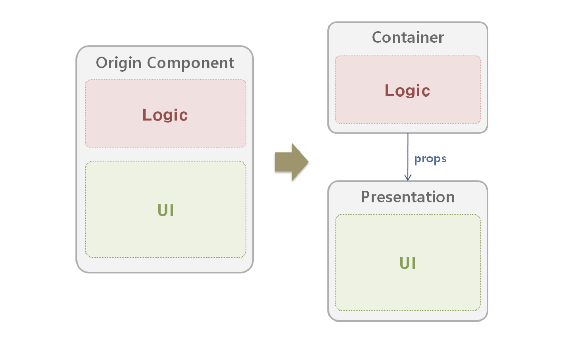
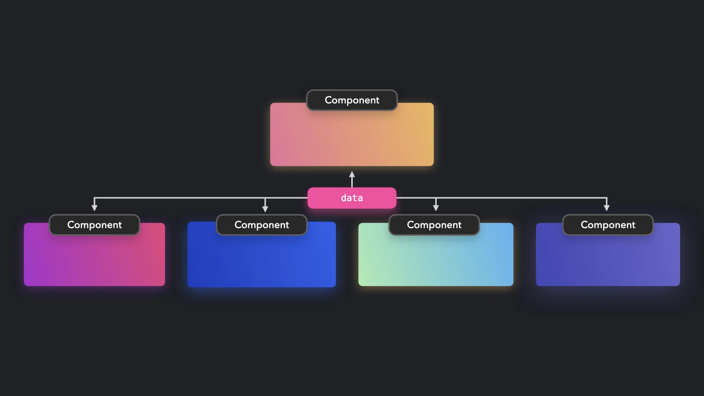

# 리액트 컴포넌트 패턴

## 프레젠테이셔널 & 컨테이너 패턴 (Presentational & Container Pattern)

> UI코드와 비즈니스 로직을 분리해서 관심사 분리를 실현하는 패턴



- `Presentational`
  : 스타일링과 구조만 담당하는 UI 컴포넌트
  : 순수 UI만 담당. props로 받은 데이터 렌더링, 이벤트 콜백 실행
- `Container`
  : 상태를 관리하고 로직을 처리하는 컴포넌트
  : 상태 관리, 데이터 요청, 이벤트 핸들링 등 비즈니스 로직 담당

### 장/단점 & 사용하는 상황

**장점**

- 리액트는 단방향 데이터 흐름을 권장하기 때문에 상태나 데이터는 상위 -> 하위로 전달되기 때문에 비즈니스 로직과 UI가 분리되는 가능성이 존재함.
- UI와 로직을 분리하여 코드 유지보수, 테스트가 쉬워짐
- 같은 presentational 컴포넌트를 여러 곳에서 재사용 가능함
- 디자이너와 협업 시에 UI레이어만 집중할 수 있음

**단점**

- 프로젝트 규모에 따라서 구조가 불필요하게 복잡해질 수 있음
- props로 전달해야하기 때문에 데이터가 많아지면 데이터 전달 과정이 복잡해질 수 있고 컴포넌트간의 결합도가 높아질 수 있음

**사용하는 상황**

- 비즈니스 로직이 복잡한 경우
- 상태 관리 라이브러리를 사용하는 경우
- 같은 UI를 여러 곳에서 재사용 하는 경우

### 예시 코드

```bash
/components/User/
  ├── UserContainer.tsx   # 상태/로직 담당
  └── UserPresenter.tsx   # UI 렌더링 담당
```

```tsx
// props로 데이터와 콜백만 받아서 렌더링만 담당
type Props = {
  name: string;
  onRefresh: () => void;
};

const UserPresenter = ({ name, onRefresh }: Props) => {
  return (
    <div>
      <h1>👤 사용자: {name}</h1>
      <button onClick={onRefresh}>새로고침</button>
    </div>
  );
};

export default UserPresenter;
```

Presentational는 상태를 갖지 않고, 오직 props로 받은 name을 보여주고 버튼을 클릭하면 콜백 함수를 실행함.

```tsx
import { useState, useEffect } from "react";
import UserPresenter from "./UserPresenter";

const UserContainer = () => {
  const [name, setName] = useState("로딩 중...");

  const fetchUser = async () => {
    const response = await fetch("/api/user");
    const data = await response.json();
    setName(data.name);
  };

  useEffect(() => {
    fetchUser();
  }, []);

  // presentaional component에 props로 데이터 전달
  return <UserPresenter name={name} onRefresh={fetchUser} />;
};

export default UserContainer;
```

Container는 API 호출과 상태 관리만 전담하고 결과만 presentaional로 넘김.

## 컴파운드 컴포넌트 패턴 (Compound Component Pattern)

> 컴포넌트를 작게 분리하고, 분리된 컴포넌트들을 조합하여 하나의 컴포넌트를 구성하는 패턴
> 내부적으로 Context를 사용해 상태와 동작을 공유함



- 부모 컴포넌트는 상태를 관리함
- 자식 컴포넌트들은 Context를 통해 props 없이도 부모의 상태나 동작을 사용함

### 장/단점 & 사용하는 상황

**장점**

- 동일한 컴포넌트를 다양한 방식으로 재사용할 수 있음
- 선언적으로 컴포넌트를 조립하여 사용할 수 있음
- 상태나 로직은 부모가 소유하고 자식은 UI만 담당하기 때문에 유지보수성이 높음
- 여러 자식 컴포넌트 간 상태공유가 가능함

**단점**

- Context에 대한 이해도가 있어야 함
- 컴포넌트 트리 구조를 지켜야 함
- 내부 로직이 복잡해질 수 있음

**사용하는 상황**

- Tabs, Modal, Accordion처럼 내부 컴포넌트 간에 상태를 공유해야 하는 UI

### 예시 코드

```bash
/components/Toggle/
  ├── Toggle.tsx         # 부모 (Provider)
  ├── ToggleOn.tsx       # 상태가 true일 때 렌더링
  ├── ToggleOff.tsx      # 상태가 false일 때 렌더링
  └── ToggleButton.tsx   # 상태 토글 버튼
```

```tsx
import { createContext, useContext } from "react";

type ToggleContextType = {
  on: boolean;
  toggle: () => void;
};

const ToggleContext = createContext<ToggleContextType | undefined>(undefined);

export const useToggleContext = () => {
  const context = useContext(ToggleContext);
  if (!context) throw new Error("Toggle 컴포넌트 안에서만 사용해야 합니다");
  return context;
};

export default ToggleContext;
```

부모에서 관리할 상태와 함수를 정의하고, 자식 컴포넌트가 사용할 수 있도록 커스텀 훅을 작성함.

```tsx
import { useState } from "react";
import ToggleContext from "./ToggleContext";

const Toggle = ({ children }: { children: React.ReactNode }) => {
  const [on, setOn] = useState(false);
  const toggle = () => setOn((prev) => !prev);

  return (
    <ToggleContext.Provider value={{ on, toggle }}>
      {children}
    </ToggleContext.Provider>
  );
};

export default Toggle;
```

부모 컴포넌트이며, 하위 컴포넌트에 상태와 동작을 context로 전달함

```tsx
import { useToggleContext } from "./ToggleContext";

const ToggleOn = ({ children }: { children: React.ReactNode }) => {
  const { on } = useToggleContext();
  return on ? <>{children}</> : null;
};

export default ToggleOn;
```

```tsx
import { useToggleContext } from "./ToggleContext";

const ToggleOff = ({ children }: { children: React.ReactNode }) => {
  const { on } = useToggleContext();
  return !on ? <>{children}</> : null;
};

export default ToggleOff;
```

context에서 상태를 가져와서 조건부로 콘텐츠를 보여줌.

```tsx
import { useToggleContext } from "./ToggleContext";

const ToggleButton = () => {
  const { toggle } = useToggleContext();
  return <button onClick={toggle}>Toggle</button>;
};

export default ToggleButton;
```

```tsx
import Toggle from "./components/Toggle/Toggle";
import ToggleOn from "./components/Toggle/ToggleOn";
import ToggleOff from "./components/Toggle/ToggleOff";
import ToggleButton from "./components/Toggle/ToggleButton";

const App = () => {
  return (
    <Toggle>
      <ToggleOn>불이 켜졌습니다 💡</ToggleOn>
      <ToggleOff>불이 꺼졌습니다 💤</ToggleOff>
      <ToggleButton />
    </Toggle>
  );
};
```

선언형으로 Toggle 컴포넌트를 구성함.
